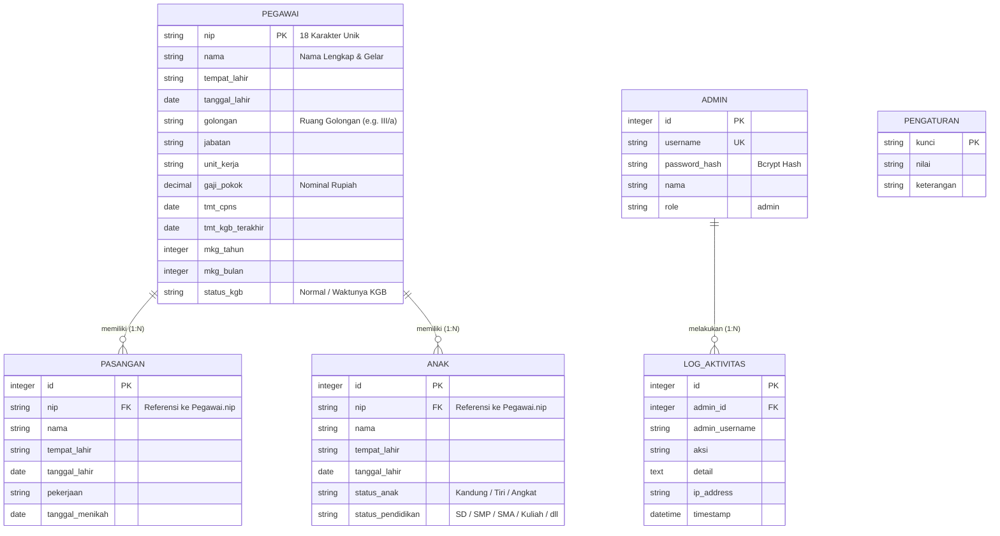

# 📋 Software Requirements Specification (SRS)
## Sistem Otomatisasi & Verifikasi Surat KP4 Pegawai Negeri Sipil (PNS)

---

### Informasi Dokumen
- **Nama Proyek:** Sistem Otomatisasi & Verifikasi Surat KP4 PNS
- **Versi Dokumen:** 1.1.0
- **Status:** Final / Disetujui (Revisi Terkini)
- **Tanggal Rilis:** 2026-09-15
- **Target Pembaca:** Pengembang Perangkat Lunak, Administrator Kepegawaian, Tim QA/Penguji, Pengambil Kebijakan Unit Kepegawaian (BKD/BKPSDM).
- **Standar Format:** Mengacu pada IEEE Std 830-1998 / ISO/IEC/IEEE 29148:2018 (*Systems and software engineering — Life cycle processes — Requirements engineering*).
- **Catatan Pembaruan (v1.1.0):** Penambahan konfigurasi dinamis pejabat penandatangan surat KP4 (Nama, Pangkat, NIP Kepala Sub Bagian Kepegawaian dan Umum) beserta *live visual preview*, restrukturisasi ergonomis tombol aksi tabel pegawai (*action-group*), dan pembaruan favicon aplikasi.

---

## Daftar Isi
1. [Pendahuluan (Introduction)](#1-pendahuluan-introduction)
   - 1.1 [Tujuan Dokumen](#11-tujuan-dokumen)
   - 1.2 [Ruang Lingkup Sistem](#12-ruang-lingkup-sistem)
   - 1.3 [Definisi, Akronim, dan Singkatan](#13-definisi-akronim-dan-singkatan)
   - 1.4 [Dasar Hukum & Regulasi Acuan](#14-dasar-hukum--regulasi-acuan)
   - 1.5 [Gambaran Umum Dokumen](#15-gambaran-umum-dokumen)
2. [Deskripsi Umum Sistem (Overall Description)](#2-deskripsi-umum-sistem-overall-description)
   - 2.1 [Perspektif Produk](#21-perspektif-produk)
   - 2.2 [Fungsi Utama Produk](#22-fungsi-utama-produk)
   - 2.3 [Karakteristik Pengguna (User Personas)](#23-karakteristik-pengguna-user-personas)
   - 2.4 [Batasan Desain & Implementasi](#24-batasan-desain--implementasi)
   - 2.5 [Asumsi dan Ketergantungan](#25-asumsi-dan-ketergantungan)
3. [Kebutuhan Antarmuka Eksternal (External Interface Requirements)](#3-kebutuhan-antarmuka-eksternal-external-interface-requirements)
   - 3.1 [Antarmuka Pengguna (User Interface)](#31-antarmuka-pengguna-user-interface)
   - 3.2 [Antarmuka Perangkat Keras (Hardware Interface)](#32-antarmuka-perangkat-keras-hardware-interface)
   - 3.3 [Antarmuka Perangkat Lunak (Software Interface)](#33-antarmuka-perangkat-lunak-software-interface)
   - 3.4 [Antarmuka Komunikasi (Communication Interface)](#34-antarmuka-komunikasi-communication-interface)
4. [Kebutuhan Fungsional (Functional Requirements)](#4-kebutuhan-fungsional-functional-requirements)
   - 4.1 [Modul Portal Publik & Verifikasi Mandiri](#41-modul-portal-publik--verifikasi-mandiri)
   - 4.2 [Modul Kalkulasi Gaji & Tunjangan Keluarga](#42-modul-kalkulasi-gaji--tunjangan-keluarga)
   - 4.3 [Modul Mesin Cetak Digital Dokumen KP4 (PDF Engine)](#43-modul-mesin-cetak-digital-dokumen-kp4-pdf-engine)
   - 4.4 [Modul Autentikasi & Keamanan Administrator](#44-modul-autentikasi--keamanan-administrator)
   - 4.5 [Modul Manajemen Data Kepegawaian & Keluarga (Admin Dashboard)](#45-modul-manajemen-data-kepegawaian--keluarga-admin-dashboard)
   - 4.6 [Modul Evaluasi & Otomasi Kenaikan Gaji Berkala (KGB)](#46-modul-evaluasi--otomasi-kenaikan-gaji-berkala-kgb)
   - 4.7 [Modul Konfigurasi Sistem](#47-modul-konfigurasi-sistem)
   - 4.8 [Modul Audit Trail & Pencatatan Log Aktivitas](#48-modul-audit-trail--pencatatan-log-aktivitas)
5. [Spesifikasi Model Data & Basis Data (Data Requirements)](#5-spesifikasi-model-data--basis-data-data-requirements)
   - 5.1 [Entity Relationship Model](#51-entity-relationship-model)
   - 5.2 [Kamus Data (Data Dictionary)](#52-kamus-data-data-dictionary)
6. [Kebutuhan Non-Fungsional (Non-Functional Requirements)](#6-kebutuhan-non-fungsional-non-functional-requirements)
   - 6.1 [Kinerja & Waktu Respon (Performance)](#61-kinerja--waktu-respon-performance)
   - 6.2 [Keamanan & Integritas Akses (Security)](#62-keamanan--integritas-akses-security)
   - 6.3 [Ketersediaan & Keandalan (Reliability & Availability)](#63-ketersediaan--keandalan-reliability--availability)
   - 6.4 [Aksesibilitas & Kegunaan (Usability)](#64-aksesibilitas--kegunaan-usability)
   - 6.5 [Pemeliharaan & Portabilitas (Maintainability & Portability)](#65-pemeliharaan--portabilitas-maintainability--portability)
7. [Matriks Ketertelusuran Kebutuhan (Requirements Traceability Matrix)](#7-matriks-ketertelusuran-kebutuhan-requirements-traceability-matrix)
8. [Penutup & Lampiran](#8-penutup--lampiran)

---

## 1. Pendahuluan (Introduction)

### 1.1 Tujuan Dokumen
Dokumen **Software Requirements Specification (SRS)** ini disusun untuk merinci seluruh kebutuhan sistem perangkat lunak, baik fungsional maupun non-fungsional, pada perancangan dan implementasi **Sistem Otomatisasi & Verifikasi Surat KP4 Pegawai Negeri Sipil (PNS)**. Dokumen ini menjadi acuan tunggal bagi perancang sistem, insinyur perangkat lunak, analis basis data, staf administrasi kepegawaian, dan penguji perangkat lunak guna memastikan seluruh batasan teknis dan aturan tata kelola administrasi kepegawaian terpenuhi secara presisi.

### 1.2 Ruang Lingkup Sistem
Sistem yang dikembangkan adalah platform web terpadu yang memfasilitasi:
1. **Layanan Mandiri Publik (Employee Self-Service):** Memungkinkan setiap pegawai memverifikasi data profil kepegawaian mereka secara instan menggunakan kombinasi Nomor Induk Pegawai (NIP 18 digit) dan Tanggal Lahir, menyesuaikan parameter masa kerja golongan (MKG), meninjau simulasi tunjangan keluarga, serta mengunduh dokumen resmi **Surat Keterangan Untuk Mendapat Pembayaran Tunjangan Keluarga (KP4)** berformat PDF yang siap dicetak.
2. **Pengelolaan Terpusat Administrator Kepegawaian:** Menyediakan antarmuka dashboard terproteksi untuk mengelola data pokok pegawai, status perkawinan (pasangan), tanggungan anak, serta memantau audit trail aktivitas.
3. **Otomasi Kenaikan Gaji Berkala (KGB):** Mendeteksi pegawai yang telah memenuhi siklus 2 tahun masa kerja secara komputasional berdasarkan TMT (*Terhitung Mulai Tanggal*) KGB terakhir, mengeksekusi kenaikan pangkat/gaji dengan formula persentase kenaikan (standar 3,15%), serta memperbarui riwayat masa kerja.
4. **Generator Berkas PDF Sesuai Standar Kedinasan:** Mesin *server-side* generasi PDF berbasis PDFKit yang menata naskah formulir KP4 secara otomatis lengkap dengan tabel susunan keluarga dan blok legalitas tanda tangan.

### 1.3 Definisi, Akronim, dan Singkatan
| Istilah / Akronim | Definisi |
| :--- | :--- |
| **KP4** | Kartu Permohonan Pembayaran Penunjang Penghasilan / Surat Keterangan Untuk Mendapat Pembayaran Tunjangan Keluarga bagi aparatur negara. |
| **PNS** | Pegawai Negeri Sipil. |
| **NIP** | Nomor Induk Pegawai, identitas resmi aparatur sipil negara berupa 18 digit angka unik. |
| **MKG** | Masa Kerja Golongan (dihitung dalam satuan tahun dan bulan). |
| **KGB** | Kenaikan Gaji Berkala (penyesuaian gaji pokok yang diberikan berkala per 2 tahun masa kerja). |
| **TMT** | Terhitung Mulai Tanggal. |
| **JWT** | *JSON Web Token*, standar keamanan transmisi klaim identitas antara klien dan server. |
| **REST API** | *Representational State Transfer Application Programming Interface*. |
| **ORM** | *Object-Relational Mapping* (Sequelize). |
| **SRS** | *Software Requirements Specification*. |

### 1.4 Dasar Hukum & Regulasi Acuan
1. **Peraturan Pemerintah (PP) No. 5 Tahun 2024** tentang Perubahan Kesembilan Belas atas Peraturan Pemerintah Nomor 7 Tahun 1977 tentang Peraturan Gaji Pegawai Negeri Sipil.
2. **Peraturan Presiden (Perpres) No. 11 Tahun 2024** tentang Penyesuaian Gaji dan Tunjangan bagi Aparatur Negara.
3. **Surat Edaran Bersama DJA dan BKN** mengenai Ketentuan Pemberian Tunjangan Keluarga Pegawai Negeri Sipil (Tunjangan Suami/Istri sebesar 10% dan Tunjangan Anak sebesar 2% maksimal untuk 2 anak tanggungan).

### 1.5 Gambaran Umum Dokumen
Bagian-bagian selanjutnya dalam dokumen ini menguraikan arsitektur sistem (Bab 2), antarmuka antarkomponen (Bab 3), rincian kebutuhan fungsional (Bab 4), spesifikasi skema data (Bab 5), atribut kualitas sistem/non-fungsional (Bab 6), dan matriks penelusuran kebutuhan (Bab 7).

---

## 2. Deskripsi Umum Sistem (Overall Description)

### 2.1 Perspektif Produk
Sistem Otomatisasi Surat KP4 merupakan sistem mandiri (*standalone client-server system*) yang dapat dioperasikan pada intranet instansi pemerintah maupun jaringan publik yang aman. Arsitektur sistem dibangun dengan model decoupled:
- **Frontend SPA (Single Page Application):** Menggunakan React 18, Vite, dan Custom Design System *Archipelago Civic*.
- **Backend Service:** Berbasis Node.js dan Express.js yang menyediakan RESTful endpoints.
- **Relational Storage:** Didukung oleh basis data SQLite 3 melalui Sequelize ORM untuk portabilitas tinggi dan zero-configuration deployment.
- **PDF Generation Engine:** Berjalan pada sisi server untuk memastikan reliabilitas tata letak cetak tanpa terpengaruh variasi rendering pada browser pengguna.

```
+-----------------------------------------------------------------------------------+
|                              LAPISAN ANTARMUKA PENGGUNA                           |
|  [Portal Mandiri Pegawai (Public)]     |   [Portal Dashboard Administrator (JWT)] |
+----------------------------------------+------------------------------------------+
                                         | HTTP / REST (JSON)
                                         v
+-----------------------------------------------------------------------------------+
|                              LAPISAN APLIKASI (EXPRESS.JS)                        |
|  - Router & Dispatcher                 - Controller (Auth, Admin, Pegawai, Print) |
|  - Middleware (JWT Token, CORS, Log)   - Service (SalaryService, PDFKit Engine)   |
+-----------------------------------------------------------------------------------+
                                         | Sequelize ORM
                                         v
+-----------------------------------------------------------------------------------+
|                              LAPISAN DATA (SQLITE 3)                              |
|  [Pegawai]   [Pasangan]   [Anak]   [Admin]   [LogAktivitas]   [Pengaturan]        |
+-----------------------------------------------------------------------------------+
```

### 2.2 Fungsi Utama Produk
1. **Validasi Identitas Pegawai Publik:** Otentikasi dua faktor identifikasi (NIP 18 Digit + Tanggal Lahir).
2. **Kalkulasi Otomatis Gaji Pokok & Tunjangan:**
   - Penentuan gaji pokok berdasarkan golongan ruang (I/a s.d IV/e dan IX) dan kelipatan 2 tahun MKG mengacu pada PP No. 5/2024.
   - Perhitungan tunjangan pasangan sebesar 10% dari gaji pokok (maksimal 1 pasangan sah).
   - Perhitungan tunjangan anak sebesar 2% dari gaji pokok per anak (maksimal 2 anak tanggungan).
   - Penjumlahan otomatis total penghasilan bruto.
3. **Penyimpanan Interaktif Masa Kerja:** Pegawai dapat memperbarui masa kerja secara mandiri dengan pencatatan instan ke basis data.
4. **Pencetakan Berkas PDF Resmi:** Pengunduhan dokumen KP4 A4 siap cetak dengan penamaan file terstruktur (`KP4_<NIP>.pdf`) serta integrasi dinamis data pejabat penandatangan (Kepala Sub Bagian Kepegawaian dan Umum).
5. **Manajemen Master Data Kepegawaian (Admin):** Modul CRUD lengkap untuk pegawai, pasangan, dan anak dengan proteksi *cascading delete* serta penataan tombol aksi baris tabel pegawai yang terstruktur (*action-group*) dan ergonomis.
6. **Sistem Evaluasi Kenaikan Gaji Berkala (KGB):** Pemindaian otomatis kelayakan KGB pegawai, penyesuaian masa kerja +2 tahun, peningkatan gaji pokok dengan rasio persentase yang dapat diatur, dan pembaruan TMT.
7. **Pengaturan Parameter Dinamis:** Antarmuka konfigurasi rasio kenaikan KGB serta pembaruan identitas Pejabat Penandatangan KP4 (Nama, Pangkat, NIP Kepala Sub Bagian) yang tersimpan persisten di basis data dan dilengkapi dengan *live preview* visual.
8. **Audit Trail Komprehensif:** Pencatatan setiap aksi modifikasi data oleh admin ke dalam tabel log beserta stempel waktu dan IP asal.

### 2.3 Karakteristik Pengguna (User Personas)

| Peran Pengguna | Tingkat Hak Akses | Deskripsi & Tanggung Jawab | Kebutuhan Teknis Utama |
| :--- | :--- | :--- | :--- |
| **Pegawai (User Publik)** | Publik / Tanpa Akun Khusus | Pegawai Negeri Sipil yang ingin memverifikasi kelengkapan data keluarga untuk tunjangan dan mengunduh formulir KP4. | Antarmuka bersih, responsif di seluler/desktop, alur cepat tanpa antrean login akun rumit, keamanan validasi NIP & tanggal lahir. |
| **Pengelola Kepegawaian (Admin)** | Terproteksi (*Authenticated Role*) | Staf atau pejabat unit Subbagian Umum/Kepegawaian yang bertugas mengelola mutasi, pembaharuan data keluarga, proses KGB, dan audit. | Dashboard komprehensif, pencarian data cepat, formulir CRUD intuitif, pemrosesan KGB instan, dan riwayat log aktivitas. |

### 2.4 Batasan Desain & Implementasi
1. Format NIP harus berupa 18 karakter numerik sesuai ketentuan BKN.
2. Generator PDF dirancang eksklusif untuk ukuran kertas internasional **A4** dengan orientasi *Portrait*.
3. Maksimal anak yang mendapatkan kalkulasi tunjangan keluarga adalah 2 anak (sesuai regulasi tunjangan PNS nasional), meskipun sistem tetap menyimpan seluruh data riil anak yang dimiliki pegawai.
4. Token otentikasi admin (JWT) memiliki masa kedaluwarsa 24 jam untuk menjaga integritas sesi kerja.
5. Basis data default menggunakan SQLite untuk kesederhanaan deployment mandiri lokal/intranet.

### 2.5 Asumsi dan Ketergantungan
1. Waktu sistem (*system clock*) pada server akurat untuk menjamin kalkulasi usia anak, selisih TMT KGB, dan stempel waktu audit trail.
2. Peramban pengguna mendukung standar modern ES6 dan rendering CSS Flexbox/Grid (Chrome, Firefox, Edge, Safari versi modern).
3. Lingkungan eksekusi memiliki runtime Node.js (versi minimal v16.x LTS atau v18.x+ disarankan).

---

## 3. Kebutuhan Antarmuka Eksternal (External Interface Requirements)

### 3.1 Antarmuka Pengguna (User Interface)
Antarmuka sistem mengadopsi bahasa desain **Archipelago Civic** dengan karakteristik visual:
- **Palet Warna:** *Civic Night* (Navy Gelap) sebagai warna struktural dominan, *Ivory White* sebagai latar belakang dokumen bersih, aksen *Teal* untuk status terverifikasi dan aksi positif, serta *Terracotta* untuk indikator peringatan atau aksi kritis.
- **Tipografi:** Kombinasi *Plus Jakarta Sans* untuk tampilan judul yang elegan dan *DM Sans* / *Inter* untuk kejelasan teks data tabular.
- **Responsivitas:** Desain tata letak berbasis *fluid grid* yang beradaptasi sempurna mulai dari layar ponsel (320px) hingga layar monitor desktop lebar (1920px).
- **Komponen Kunci UI:**
  - *Hero & Quick Verification Form:* Formulir verifikasi 2 input (NIP & Tanggal Lahir) dengan feedback instan.
  - *Data Preview Cards:* Kartu ringkasan terstruktur memisahkan Data Pegawai, Informasi Pasangan, Tanggungan Anak, dan Rincian Finansial.
  - *Interactive MKG Simulator:* Penggeser/input tahun dan bulan masa kerja dengan pembaruan kalkulasi angka secara real-time.
  - *Admin Workspace Shell:* Sidebar navigasi dinamis, kartu metrik ringkasan, input filter pencarian instan, modal konfirmasi aksi, dan tabel data berpaginasi rapi.

### 3.2 Antarmuka Perangkat Keras (Hardware Interface)
- Sistem tidak berkomunikasi langsung dengan perangkat keras khusus selain melalui perantara sistem operasi standar.
- Berkas PDF yang dihasilkan dioptimalkan untuk dicetak pada perangkat *printer laserjet* atau *inkjet* standar kantor dengan resolusi 300 DPI ke atas.

### 3.3 Antarmuka Perangkat Lunak (Software Interface)
- **Runtime Server:** Node.js versi 18 LTS ke atas.
- **Framework Web Server:** Express.js 4.x.
- **Basis Data:** SQLite3 dengan abstraction layer Sequelize ORM v6.
- **Perpustakaan Kriptografi & Sesi:** `bcryptjs` untuk hashing password admin (salt factor 10) dan `jsonwebtoken` untuk pembuatan payload otentikasi.
- **Pustaka Generasi Dokumen:** `pdfkit` versi 0.13.x untuk pembuatan *stream binary PDF*.

### 3.4 Antarmuka Komunikasi (Communication Interface)
- Protokol komunikasi menggunakan **HTTP/1.1** dan mendukung **HTTPS (TLS 1.2 / TLS 1.3)**.
- Format pertukaran payload data permintaan (*request*) dan tanggapan (*response*) adalah **application/json; charset=utf-8**.
- Respon pencetakan dokumen menggunakan tipe konten biner **application/pdf** dengan header `Content-Disposition: attachment; filename="KP4_<NIP>.pdf"`.

---

## 4. Kebutuhan Fungsional (Functional Requirements)

### 4.1 Modul Portal Publik & Verifikasi Mandiri

#### [FR-01] Validasi Identitas Pegawai Publik
- **Deskripsi:** Sistem harus memvalidasi data pegawai berdasarkan NIP dan Tanggal Lahir yang diinputkan melalui portal publik.
- **Input:** `nip` (string 18 digit), `tanggal_lahir` (string tanggal format `YYYY-MM-DD`).
- **Proses:**
  1. Memeriksa keberadaan kedua parameter input (tidak boleh kosong).
  2. Mencari record pegawai pada basis data yang mencocokkan `nip` dan `tanggal_lahir`.
  3. Memuat data relasi pasangan dan anak yang berasosiasi dengan NIP tersebut.
  4. Menyertakan informasi persentase kenaikan KGB aktif dari konfigurasi sistem.
- **Output:** Payload JSON data lengkap pegawai beserta relasi keluarga dan status 200 OK jika valid, atau status 404 Not Found / 400 Bad Request jika data tidak cocok.

#### [FR-02] Penyesuaian Interaktif Masa Kerja Golongan (MKG)
- **Deskripsi:** Sistem harus mengizinkan pegawai yang terverifikasi untuk menyesuaikan angka masa kerja golongan (tahun dan bulan) dan menyimpannya langsung ke database.
- **Input:** `nip`, `tanggal_lahir`, `mkg_tahun` (integer ≥ 0), `mkg_bulan` (integer 0–11).
- **Proses:**
  1. Validasi ulang kecocokan NIP dan tanggal lahir.
  2. Menghitung kembali gaji pokok otomatis berdasarkan golongan dan nilai `mkg_tahun` baru.
  3. Memperbarui record kolom `mkg_tahun`, `mkg_bulan`, dan `gaji_pokok` pada tabel pegawai.
- **Output:** Konfirmasi penyimpanan berhasil dan kalkulasi gaji baru dalam format JSON.

---

### 4.2 Modul Kalkulasi Gaji & Tunjangan Keluarga

#### [FR-03] Komputasi Gaji Pokok Otomatis (Tabel Acuan PP No. 5/2024)
- **Deskripsi:** Sistem harus mampu menghitung gaji pokok otomatis untuk seluruh golongan ruang (I/a hingga IV/e serta PPPK Golongan IX) berdasarkan masa kerja.
- **Rumus Perhitungan:**
  $$\text{Gaji Pokok} = \text{Gaji Dasar}_{2024}(\text{Golongan}) \times (1 + \text{Persen KGB})^{\lfloor \text{MKG Tahun} / 2 \rfloor}$$
  - Default `Persen KGB` = 3,15% (0.0315).
  - Nilai nominal dibulatkan ke bilangan bulat terdekat (*Math.round*).

#### [FR-04] Komputasi Tunjangan Keluarga
- **Deskripsi:** Sistem harus menghitung rincian tunjangan keluarga dari gaji pokok yang berlaku:
  1. **Tunjangan Pasangan (Suami/Istri):**
     $$\text{Tunjangan Pasangan} = \text{Gaji Pokok} \times 10\% \times \min(1, \text{Jumlah Pasangan Sah})$$
  2. **Tunjangan Anak:**
     $$\text{Tunjangan Anak} = \text{Gaji Pokok} \times 2\% \times \min(2, \text{Jumlah Anak Sah})$$
  3. **Total Tunjangan:**
     $$\text{Total Tunjangan} = \text{Tunjangan Pasangan} + \text{Tunjangan Anak}$$
  4. **Total Penghasilan Bruto:**
     $$\text{Total Bruto} = \text{Gaji Pokok} + \text{Total Tunjangan}$$

---

### 4.3 Modul Mesin Cetak Digital Dokumen KP4 (PDF Engine)

#### [FR-05] Pembuatan Berkas PDF Resmi KP4
- **Deskripsi:** Sistem harus menghasilkan dokumen PDF berstandar formulir kedinasan KP4 secara *stream* langsung ke browser pengguna.
- **Struktur Dokumen:**
  1. **Kop & Judul:** Header resmi *"SURAT KETERANGAN PENGISIAN PENUNJANGAN PERMINTAAN PEMBAYARAN (KP4)"* dengan garis batas pemisah tebal.
  2. **Bagian I (Data Pegawai):** Nama lengkap, NIP, Tempat/Tanggal Lahir, Jenis Kelamin, Pangkat/Golongan Ruang, Jabatan, Satuan Kerja, Masa Kerja Golongan (Tahun & Bulan), dan Gaji Pokok Terhitung.
  3. **Bagian II (Data Pasangan):** Nama Suami/Istri, Tempat/Tanggal Lahir, Pekerjaan/NIP, Tanggal Pernikahan, dan Status Perkawinan.
  4. **Bagian III (Tabel Susunan Anak):** Tabel kolom bergaris rapi berisi Nomor, Nama Anak, Tempat/Tanggal Lahir, Status Hubungan (Kandung/Tiri/Angkat), dan Status Pendidikan.
  5. **Bagian Penutup & Legalitas:** Tanggal penerbitan surat, kolom tanda tangan Pejabat yang Berwenang (Kepala Sub Bagian Kepegawaian dan Umum dengan Nama Lengkap, Pangkat/Golongan, dan NIP dinamis dari pengaturan sistem aktif), dan kolom tanda tangan Pegawai yang bersangkutan.
- **Format Keluaran:** Berkas stream biner A4 dengan margin 35pt (top/bottom) dan 45pt (left/right).

---

### 4.4 Modul Autentikasi & Keamanan Administrator

#### [FR-06] Autentikasi Admin Berbasis JWT
- **Deskripsi:** Sistem harus membatasi akses modul pengelolaan hanya untuk administrator yang terautentikasi melalui kredensial yang sah.
- **Input:** `username`, `password`.
- **Proses:**
  1. Mencari akun admin berdasarkan `username`.
  2. Memverifikasi kecocokan password menggunakan `bcrypt.compare`.
  3. Menghasilkan token JWT dengan masa berlaku 24 jam bertandatangan kunci rahasia (`JWT_SECRET`).
- **Output:** Token JWT, data profil singkat admin, dan stempel sesi.

#### [FR-07] Penolakan Akses Tanpa Otorisasi
- **Deskripsi:** Seluruh route `/api/admin/*` wajib melewati middleware validasi header `Authorization: Bearer <token>`. Jika token tidak ada, kedaluwarsa, atau tidak valid, sistem mengembalikan kode HTTP 401 Unauthorized atau 403 Forbidden.

---

### 4.5 Modul Manajemen Data Kepegawaian & Keluarga (Admin Dashboard)

#### [FR-08] Pengelolaan Data Pegawai (CRUD) & Antarmuka Terstruktur
- **Deskripsi:** Administrator dapat melihat daftar seluruh pegawai, mencari, menambah, mengubah, dan menghapus data pegawai.
- **Fitur Spesifik:**
  - Menampilkan daftar dengan informasi NIP, Nama, Golongan, Unit Kerja, Gaji Pokok, dan Masa Kerja.
  - Pencarian fleksibel berdasarkan kombinasi nama, NIP, dan instansi unit kerja.
  - **Tata Letak Aksi Terstruktur (Ergonomi Antarmuka):** Baris data tabel pegawai mengelompokkan tombol aksi "Buka" (tinjau detail) dan tombol ikon "Hapus" ke dalam wadah terstruktur (`action-group`) dengan spasi terukur (`gap: 10px`) untuk mencegah salah klik antara aksi navigasi dan aksi destruktif.
  - Saat penambahan/pengubahan pegawai, jika gaji pokok tidak diisi, sistem menghitung otomatis dari golongan dan masa kerja.
  - Saat pegawai dihapus, sistem melakukan *cascading delete* terhadap seluruh data pasangan dan anak terkait.

#### [FR-09] Pengelolaan Data Pasangan (CRUD)
- **Deskripsi:** Administrator dapat menambah, memperbarui, dan menghapus data pasangan yang terikat pada NIP pegawai bersangkutan.
- **Field Data:** `id`, `nip`, `nama`, `tempat_lahir`, `tanggal_lahir`, `pekerjaan`, `tanggal_menikah`.

#### [FR-10] Pengelolaan Data Anak (CRUD)
- **Deskripsi:** Administrator dapat menambah, memperbarui, dan menghapus data anak tanggungan pegawai.
- **Field Data:** `id`, `nip`, `nama`, `tempat_lahir`, `tanggal_lahir`, `status_anak` (*Kandung / Tiri / Angkat*), `status_pendidikan` (*Belum Sekolah / SD / SMP / SMA / Kuliah / Bekerja*).

---

### 4.6 Modul Evaluasi & Otomasi Kenaikan Gaji Berkala (KGB)

#### [FR-11] Deteksi Otomatis Kelayakan Kenaikan Gaji Berkala
- **Deskripsi:** Sistem harus secara periodik atau on-demand memindai seluruh pegawai untuk menyaring pegawai yang memenuhi syarat kenaikan gaji berkala.
- **Kriteria Kelayakan:**
  1. Selisih antara tanggal hari ini dengan `tmt_kgb_terakhir` pegawai telah mencapai minimal 24 bulan (2 tahun).
  2. ATAU nilai status pada kolom `status_kgb` adalah `'Waktunya KGB'`.
- **Output:** Daftar pegawai layak KGB beserta rincian komparasi masa kerja lama vs baru, gaji pokok lama vs baru, dan estimasi kenaikan tunjangan keluarga.

#### [FR-12] Pemrosesan KGB Terotomatisasi (1-Click Action)
- **Deskripsi:** Administrator dapat mengeksekusi pemrosesan KGB untuk pegawai terpilih dengan satu kali klik.
- **Aksi Pemrosesan:**
  1. Masa Kerja Golongan (`mkg_tahun`) bertambah +2 tahun.
  2. Gaji pokok (`gaji_pokok`) disesuaikan otomatis dengan rumus kenaikan gaji persentase acuan.
  3. Nilai `tmt_kgb_terakhir` diperbarui ke tanggal hari ini (`YYYY-MM-DD`).
  4. Status KGB direset kembali menjadi `'Normal'`.
  5. Mencatat aktivitas pemrosesan ke tabel audit log.

---

### 4.7 Modul Konfigurasi Sistem

#### [FR-13] Pengaturan Persentase Kenaikan KGB
- **Deskripsi:** Sistem harus menyediakan fungsi bagi administrator untuk melihat dan mengubah parameter persentase kenaikan gaji berkala (standar: 3.15%).
- **Penyimpanan:** Nilai disimpan persisten di tabel `pengaturan` dengan kunci `persen_kenaikan_kgb`.
- **Efek:** Seluruh perhitungan estimasi gaji dan eksekusi KGB selanjutnya akan langsung merujuk pada persentase terbaru ini.

#### [FR-13B] Pengaturan Dinamis Pejabat Penandatangan Dokumen KP4
- **Deskripsi:** Sistem harus menyediakan fungsi bagi administrator untuk memperbarui data pejabat penandatangan formulir KP4 (Kepala Sub Bagian Kepegawaian dan Umum) agar keluaran dokumen PDF tetap akurat sewaktu terjadi mutasi atau pergantian pejabat tanpa memodifikasi kode program.
- **Input:** `kepala_sub_nama` (string), `kepala_sub_pangkat` (string), `kepala_sub_nip` (string).
- **Pratinjau Visual (Live Preview):** Antarmuka dashboard menampilkan blok *live preview* tanda tangan secara langsung mengikuti perubahan nilai input sebelum atau sesudah disimpan.
- **Penyimpanan:** Disimpan secara persisten pada tabel `pengaturan` menggunakan operasi *upsert* untuk kunci `kepala_sub_nama`, `kepala_sub_pangkat`, dan `kepala_sub_nip`.
- **Nilai Bawaan (Fallback):** Bila pengaturan belum disetel, sistem secara otomatis menggunakan nilai fallback bawaan: Nama: `Drs. ILYAS, M.Ap`, Pangkat: `Pembina`, NIP: `19691211 200212 1 005`.
- **Efek:** Generator berkas PDF membaca data pejabat penandatangan ini pada setiap permintaan pengunduhan dokumen KP4.

---

### 4.8 Modul Audit Trail & Pencatatan Log Aktivitas

#### [FR-14] Perekaman Otomatis Aktivitas Modifikasi Data
- **Deskripsi:** Setiap kali terjadi aksi `CREATE`, `UPDATE`, `DELETE`, `PROCESS KGB`, serta pembaruan parameter konfigurasi sistem dan pejabat penandatangan pada portal admin, sistem wajib mencatat aktivitas tersebut ke dalam basis data.
- **Struktur Log:**
  - ID aktivitas (*Auto-increment*)
  - ID dan Username admin pelaksana
  - Deskripsi ringkas aksi
  - Detail payload perubahan data (dalam format teks/JSON)
  - Alamat IP asal permintaan (*IP Address*)
  - Stempel waktu kejadian (*Timestamp*)

#### [FR-15] Pemantauan Log pada Antarmuka Admin
- **Deskripsi:** Antarmuka khusus `/admin/logs` menampilkan riwayat aktivitas terbaru (maksimal 100 log teratas) secara kronologis menurun (*descending*).

---

## 5. Spesifikasi Model Data & Basis Data (Data Requirements)

### 5.1 Entity Relationship Model



### 5.2 Kamus Data (Data Dictionary)

#### Tabel: `pegawai`
Menyimpan entitas data pokok Pegawai Negeri Sipil.
| Nama Kolom | Tipe Data | Keterangan / Batasan |
| :--- | :--- | :--- |
| `nip` | VARCHAR(18) | **Primary Key**, 18 digit unik pegawai. |
| `nama` | VARCHAR(100) | Wajib diisi (*NOT NULL*), nama lengkap pegawai. |
| `tempat_lahir` | VARCHAR(50) | Kota/kabupaten tempat lahir. |
| `tanggal_lahir` | DATE | Wajib diisi (*NOT NULL*), digunakan untuk validasi publik. |
| `golongan` | VARCHAR(10) | Pangkat dan ruang golongan (misal: `III/a`, `IV/b`, `IX`). |
| `jabatan` | VARCHAR(100) | Jabatan fungsional atau struktural pegawai. |
| `unit_kerja` | VARCHAR(150) | Nama satuan kerja atau instansi dinas. |
| `gaji_pokok` | DECIMAL(15,2) | Besaran nominal gaji pokok bulanan (Rupiah). |
| `tmt_cpns` | DATE | Tanggal mulai pengangkatan sebagai CPNS. |
| `tmt_kgb_terakhir`| DATE | Tanggal TMT kenaikan gaji berkala terakhir. |
| `mkg_tahun` | INTEGER | Masa kerja golongan dalam satuan tahun (default: 0). |
| `mkg_bulan` | INTEGER | Masa kerja golongan dalam satuan bulan (default: 0). |
| `status_kgb` | VARCHAR(20) | Status periodik KGB (`Normal` atau `Waktunya KGB`). |
| `createdAt` | DATETIME | Waktu pembuatan baris data. |
| `updatedAt` | DATETIME | Waktu pembaruan data terakhir. |

#### Tabel: `pasangan`
Menyimpan data suami atau istri dari pegawai.
| Nama Kolom | Tipe Data | Keterangan / Batasan |
| :--- | :--- | :--- |
| `id` | INTEGER | **Primary Key**, Auto-Increment. |
| `nip` | VARCHAR(18) | **Foreign Key** mereferensikan `pegawai.nip` (*Cascade Delete*). |
| `nama` | VARCHAR(100) | Wajib diisi, nama lengkap pasangan. |
| `tempat_lahir` | VARCHAR(50) | Kota lahir pasangan. |
| `tanggal_lahir` | DATE | Tanggal lahir pasangan. |
| `pekerjaan` | VARCHAR(100) | Profesi/pekerjaan atau NIP jika sesama PNS. |
| `tanggal_menikah`| DATE | Tanggal perkawinan resmi tercatat. |
| `createdAt` | DATETIME | Waktu pembuatan record. |
| `updatedAt` | DATETIME | Waktu modifikasi record. |

#### Tabel: `anak`
Menyimpan daftar anak kandung, tiri, atau angkat yang menjadi tanggungan.
| Nama Kolom | Tipe Data | Keterangan / Batasan |
| :--- | :--- | :--- |
| `id` | INTEGER | **Primary Key**, Auto-Increment. |
| `nip` | VARCHAR(18) | **Foreign Key** mereferensikan `pegawai.nip` (*Cascade Delete*). |
| `nama` | VARCHAR(100) | Wajib diisi, nama lengkap anak. |
| `tempat_lahir` | VARCHAR(50) | Kota lahir anak. |
| `tanggal_lahir` | DATE | Wajib diisi, tanggal lahir anak. |
| `status_anak` | VARCHAR(20) | Hubungan status anak (`Kandung`, `Tiri`, `Angkat`). |
| `status_pendidikan` | VARCHAR(30) | Status sekolah/kuliah saat ini. |
| `createdAt` | DATETIME | Waktu pembuatan data. |
| `updatedAt` | DATETIME | Waktu modifikasi data. |

#### Tabel: `admin`
Menyimpan kredensial staf pengelola sistem kepegawaian.
| Nama Kolom | Tipe Data | Keterangan / Batasan |
| :--- | :--- | :--- |
| `id` | INTEGER | **Primary Key**, Auto-Increment. |
| `username` | VARCHAR(50) | **Unique**, Wajib diisi, nama identitas login admin. |
| `password_hash` | VARCHAR(255) | Hash password bcrypt (10 rounds). |
| `nama` | VARCHAR(100) | Nama terang staf admin. |
| `role` | VARCHAR(20) | Hak akses sistem (default: `'admin'`). |
| `createdAt` | DATETIME | Waktu registrasi akun admin. |

#### Tabel: `log_aktivitas`
Menyimpan seluruh jejak audit administratif yang terjadi di portal internal.
| Nama Kolom | Tipe Data | Keterangan / Batasan |
| :--- | :--- | :--- |
| `id` | INTEGER | **Primary Key**, Auto-Increment. |
| `admin_id` | INTEGER | **Foreign Key** mereferensikan `admin.id` (nullable). |
| `admin_username` | VARCHAR(50) | Username pelaksana saat aksi terjadi. |
| `aksi` | VARCHAR(255) | Deskripsi singkat tindakan yang dieksekusi. |
| `detail` | TEXT | Snapshot data atau payload perubahan (format teks/JSON). |
| `ip_address` | VARCHAR(45) | Alamat IP pemanggil (IPv4 atau IPv6). |
| `timestamp` | DATETIME | Waktu rekaman aksi dicatat (Default: NOW). |

#### Tabel: `pengaturan`
Menyimpan parameter konfigurasi global sistem secara *key-value*.
| Nama Kolom | Tipe Data | Keterangan / Batasan |
| :--- | :--- | :--- |
| `kunci` | VARCHAR(50) | **Primary Key**, nama konfigurasi. Kunci aktif meliputi: `persen_kenaikan_kgb` (persentase kenaikan KGB), `kepala_sub_nama` (nama pejabat penandatangan KP4), `kepala_sub_pangkat` (pangkat pejabat penandatangan), dan `kepala_sub_nip` (NIP pejabat penandatangan). |
| `nilai` | VARCHAR(255) | Nilai konfigurasi dalam format teks. |
| `keterangan` | VARCHAR(255) | Deskripsi parameter. |
| `createdAt` | DATETIME | Waktu pembuatan konfigurasi. |
| `updatedAt` | DATETIME | Waktu pembaruan konfigurasi. |

---

## 6. Kebutuhan Non-Fungsional (Non-Functional Requirements)

### 6.1 Kinerja & Waktu Respon (Performance)
- **[NFR-01] Kecepatan Respon Kueri API:** Endpoint validasi pegawai dan kueri data harus merespons dalam waktu kurang dari **200 milidetik** pada beban kerja tipikal kantor.
- **[NFR-02] Kecepatan Sintesis Berkas PDF:** Mesin pembuat berkas PDF harus menyelesaikan penyusunan berkas KP4 A4 dan memulai pengaliran data (*streaming*) dalam waktu kurang dari **800 milidetik**.
- **[NFR-03] Optimasi Ukuran Bundel Frontend:** Ukuran berkas aset client (JS dan CSS) hasil build produksi Vite tidak melebihi **400 KB** (terkompresi gzip) guna menjamin kecepatan buka halaman di koneksi terbatas.

### 6.2 Keamanan & Integritas Akses (Security)
- **[NFR-04] Enkripsi Password Administrator:** Seluruh kata sandi admin wajib disimpan dalam bentuk hash terenkripsi satu arah menggunakan pustaka `bcrypt` dengan faktor garam (*salt*) minimal 10 putaran.
- **[NFR-05] Keamanan Token Sesi (JWT):** Token JWT wajib ditandatangani menggunakan algoritma HMAC-SHA256 (`HS256`) dengan secret key terisolasi dalam berkas `.env` dan masa aktif token maksimal 24 jam.
- **[NFR-06] Pencegahan Injeksi SQL:** Seluruh interaksi pembacaan dan penulisan ke basis data wajib menggunakan kueri terparameter (*parameterized queries*) yang ditangani secara native oleh Sequelize ORM.
- **[NFR-07] Sanitasi Input Data:** Data masukan yang dikirim melalui permintaan POST/PUT wajib dibersihkan dari nilai string kosong berlebih untuk menghindari anomali tipe data (*data type pollution*).

### 6.3 Ketersediaan & Keandalan (Reliability & Availability)
- **[NFR-08] Penanganan Kesalahan (Error Handling):** Setiap kesalahan pada server backend wajib ditangkap dengan blok `try-catch` terstruktur dan mengembalikan status HTTP yang representatif (400, 401, 404, 500) dengan pesan JSON informatif tanpa mengekspos *stack trace* internal ke klien.
- **[NFR-09] Integritas Referensial (*Referential Integrity*):** Penghapusan baris pada tabel induk `pegawai` secara otomatis menghapus record anak pada tabel `pasangan` dan `anak` (*CASCADE*) guna mencegah terjadinya data yatim piatu (*orphan records*).

### 6.4 Aksesibilitas & Kegunaan (Usability)
- **[NFR-10] Standar Estetika UI Modern:** Antarmuka harus memenuhi standar ergonomi visual modern dengan skema warna yang memiliki rasio kontras tinggi sesuai panduan WCAG 2.1 Level AA untuk keterbacaan teks.
- **[NFR-11] Kejelasan Umpan Balik Pengguna:** Setiap aksi kritis (penyimpanan masa kerja, penambahan data, penghapusan pegawai, pemrosesan KGB) wajib menyajikan konfirmasi visual yang jelas (pesan sukses berwarna hijau/teal atau pesan kesalahan yang tegas).

### 6.5 Pemeliharaan & Portabilitas (Maintainability & Portability)
- **[NFR-12] Portabilitas Multi-Platform:** Sistem wajib dapat dijalankan pada berbagai platform sistem operasi (Windows, Linux, macOS) tanpa perlu instalasi DBMS eksternal yang rumit berkat integrasi SQLite dan dependensi berbasis Node.js murni.
- **[NFR-13] Skrip Peluncuran Terintegrasi:** Proyek wajib menyediakan skrip automasi tunggal (`npm run dev` atau `start-dev.bat`) untuk meluncurkan backend dan frontend sekaligus dalam satu perintah.

---

## 7. Matriks Ketertelusuran Kebutuhan (Requirements Traceability Matrix)

Matriks berikut menghubungkan kebutuhan pengguna, kebutuhan fungsional (FR), implementasi modul kode, dan endpoint API yang relevan:

| Kode Kebutuhan | Deskripsi Singkat | Modul Backend / Frontend Terkait | Endpoint REST API |
| :--- | :--- | :--- | :--- |
| **FR-01** | Validasi NIP & Tanggal Lahir Publik | `PegawaiPage.jsx`, `pegawaiController.js` | `POST /api/print/validate` |
| **FR-02** | Penyesuaian Interaktif MKG | `PegawaiPage.jsx`, `pegawaiController.js` | `POST /api/print/update-mkg` |
| **FR-03** | Komputasi Gaji Otomatis (PP 5/2024) | `salaryService.js` | Digunakan internal controller |
| **FR-04** | Komputasi Tunjangan Keluarga | `salaryService.js` | Digunakan internal controller & PDF |
| **FR-05** | Generator PDF Resmi KP4 & Tanda Tangan Dinamis | `pdfGenerator.js`, `printController.js` | `POST` / `GET /api/print/generate` |
| **FR-06** | Autentikasi Admin JWT | `AdminLoginPage.jsx`, `authController.js` | `POST /api/auth/login` |
| **FR-07** | Otorisasi & Guard Middleware | `middleware/auth.js` | Dipasang di seluruh `/api/admin/*` |
| **FR-08** | CRUD Pegawai, Hitung Gaji Baru, & Aksi Terstruktur | `DashboardPage.jsx`, `adminController.js` | `GET`, `POST`, `PUT`, `DELETE /api/admin/pegawai` |
| **FR-09** | CRUD Data Pasangan | `DashboardPage.jsx`, `adminController.js` | `POST`, `PUT`, `DELETE /api/admin/pasangan` |
| **FR-10** | CRUD Data Tanggungan Anak | `DashboardPage.jsx`, `adminController.js` | `POST`, `PUT`, `DELETE /api/admin/anak` |
| **FR-11** | Deteksi Otomatis Kelayakan KGB | `DashboardPage.jsx`, `adminController.js` | `GET /api/admin/kgb/eligible` |
| **FR-12** | Pemrosesan KGB Terotomatisasi | `DashboardPage.jsx`, `adminController.js` | `POST /api/admin/kgb/process/:nip` |
| **FR-13** | Konfigurasi Persentase KGB | `DashboardPage.jsx`, `adminController.js` | `GET`, `POST /api/admin/settings` |
| **FR-13B**| Konfigurasi Pejabat Penandatangan KP4 & Live Preview | `DashboardPage.jsx`, `adminController.js` | `GET`, `POST /api/admin/settings` |
| **FR-14** | Perekaman Jejak Audit Otomatis | `adminController.js`, `LogAktivitas.js` | Dieksekusi otomatis pada setiap mutasi data |
| **FR-15** | Antarmuka Audit Trail | `LogAktivitasPage.jsx`, `adminController.js`| `GET /api/admin/logs` |

---

## 8. Penutup & Lampiran

Dokumen Spesifikasi Kebutuhan Perangkat Lunak (SRS) ini telah dirumuskan secara komprehensif untuk mencerminkan seluruh kapabilitas, arsitektur teknis, model relasional, serta kepatuhan hukum dari Sistem Otomatisasi & Verifikasi Surat KP4 PNS. 

Dokumen ini menjadi landasan formal bagi proses pengembangan berkesinambungan, pengujian berkala, maupun integrasi masa depan ke Sistem Informasi Kepegawaian Nasional (misal: SIASN BKN).

---
*Dokumen ini merupakan bagian resmi dari repositori proyek Sistem Otomatisasi Surat KP4 PNS.*
